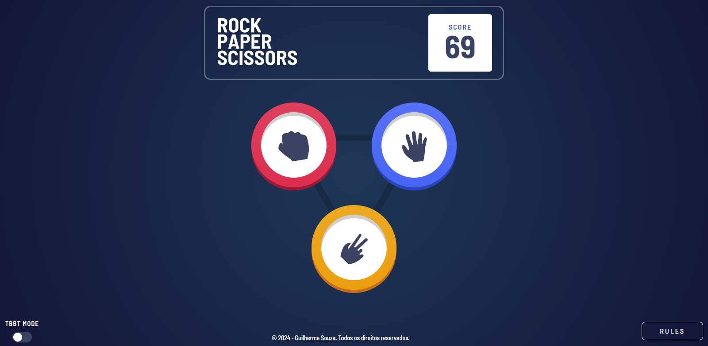

# Rock Paper Scissors



## Descrição

Este é o meu projeto para o desafio Rock Paper Scissors do Frontend Mentor, desenvolvido utilizando React, Typescript, TailwindCSS e Radix-UI.

Nota: Este projeto estende o clássico Rock Paper Scissors com as opções adicionais de Lizard e Spock para uma experiência mais desafiadora.

_All hail Sam Kass!_

[Link do Desafio](https://www.frontendmentor.io/challenges/rock-paper-scissors-game-pTgwgvgH)

[Live](https://rock-paper-scissors-kappa-pride.vercel.app)

## Funcionalidades

- Escolha entre Rock, Paper, Scissors, Lizard ou Spock.

- Oponente computador escolhe aleatoriamente.

- Exibição do resultado do jogo.

- Razão da vitória.

- Design responsivo e moderno utilizando Tailwind CSS.

- Integração de componentes de interface com Radix-UI.

## Como Executar

1. Certifique-se de ter o Node.js instalado.
2. Clone o repositório.
3. Instale as dependências usando o comando:
   ```
   npm install
   ```
4. Inicie o aplicativo com:
   ```
   npm run dev
   ```
5. Abra o aplicativo no seu navegador.

## Contribuições

Contribuições são bem-vindas! Sinta-se à vontade para abrir problemas ou enviar pull requests.
